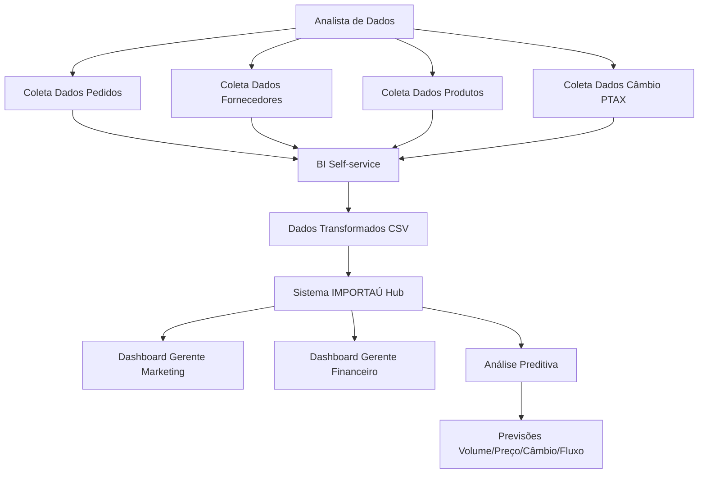
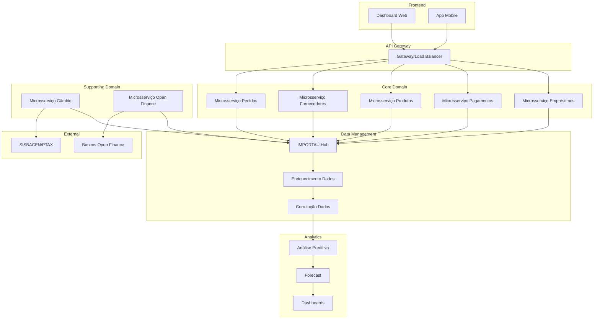

# Análise de Requisitos - Sistema IMPORTAÚ Open Finance

## Resumo Executivo

O projeto visa desenvolver uma solução baseada em Open Finance para gerenciar operações e dados analíticos da IMPORTAÚ LTDA, empresa do setor de comércio exterior. A solução integrará dados de múltiplos bancos com sistemas internos para fornecer insights estratégicos sobre importações, pagamentos, câmbio e análise preditiva.

## 1. Objetivo do Sistema

### 1.1 Propósito Principal
Construir uma plataforma integrada que gerencie operações financeiras e forneça análise de dados para apoiar decisões estratégicas em comércio exterior.

### 1.2 Problemas Resolvidos
- Falta de controle eficiente de pagamentos de importação/exportação
- Dificuldade de análise de dados bancários dispersos
- Ausência de insights sobre tendências de mercado
- Decisões baseadas em suposições ao invés de dados

### 1.3 Usuários Principais
- Gerente Financeiro
- Gerente de Marketing  
- Analista de Dados
- Executivos da IMPORTAÚ LTDA

### 1.4 Diferencial Competitivo
Integração completa entre dados financeiros (Open Finance) e operacionais internos com análise preditiva avançada.

## 2. Contexto Operacional

### 2.1 Proposta da Solução
Sistema de Data Mesh com características de hub central que integra:
- Dados financeiros via Open Finance (3 bancos incluindo Itaú)
- Microsserviços internos (pedidos, fornecedores, produtos)
- Dados externos (SISBACEN/PTAX para câmbio)
- Análise preditiva com Machine Learning

### 2.2 Integrações Necessárias
- APIs Open Finance dos bancos
- Sistema SISBACEN (PTAX)
- Microsserviços internos existentes
- Sistemas de BI e dashboards

### 2.3 Restrições Identificadas
- Conformidade com regulamentação Open Finance
- Segurança de dados financeiros sensíveis
- Latência de APIs bancárias
- Volumes de dados históricos

## 3. Regras de Negócio

### 3.1 Processos Principais (Domain Storytelling)



### 3.2 Validações BDD (Behavior Driven Development)

**Cenário: Correlação de Pagamento com Pedido**
```gherkin
Funcionalidade: Correlacionar transações financeiras com pedidos
  Como gerente financeiro
  Quero correlacionar pagamentos bancários com pedidos internos
  Para ter visibilidade completa do fluxo operacional

Cenário: Correlação bem-sucedida
  Dado que existe um pedido "PED-001" no valor de R$ 10.000,00
  E existe uma transação bancária de R$ 10.000,00 na mesma data
  Quando o sistema processar a correlação
  Então a transação deve ser vinculada ao pedido "PED-001"
  E o status do pedido deve ser atualizado para "Pago"
```

## 4. Projeto da Solução (Domain Driven Design)

### 4.1 Microsserviços Identificados

#### Core Domain (Domínio Principal)
- **Microsserviço de Pedidos**: Gestão de compras e ordens
- **Microsserviço de Fornecedores**: Cadastro e gestão de fornecedores
- **Microsserviço de Produtos**: Catálogo e categorização
- **Microsserviço de Pagamentos**: Transações financeiras
- **Microsserviço de Empréstimos**: Gestão de crédito

#### Supporting Domain (Domínio de Suporte)  
- **Microsserviço de Câmbio**: Integração SISBACEN/PTAX
- **Microsserviço de Open Finance**: Integração bancária

#### Data Management (Gestão de Dados)
- **Microsserviço IMPORTAÚ Hub**: Orquestração central
- **Microsserviço de Enriquecimento**: Transformação de dados
- **Microsserviço de Correlação**: Vinculação de dados

#### Analytics & Intelligence
- **Microsserviço de Análise Preditiva**: Machine Learning
- **Microsserviço de Forecast**: Previsões
- **Microsserviço de Dashboards**: Visualização

### 4.2 Métricas de Sucesso
- Redução de 80% no tempo de análise financeira
- Aumento de 30% na precisão de previsões
- 99.5% de disponibilidade do sistema
- Correlação automática de 95% das transações

## 5. Requisitos Funcionais

### FUNC-01: Volume de Importação por Categoria
**Descrição**: Visualizar volume de importação agrupado por categoria de produtos
**Atores**: Gerente de Marketing, Analista de Dados
**Pré-condições**: Dados de pedidos e pagamentos disponíveis
**Fluxo Principal**:
1. Usuário seleciona período de análise
2. Sistema agrega dados por categoria
3. Sistema identifica origem do recurso (Conta Corrente, Empréstimo, Cartão)
4. Sistema exibe dashboard com volumes por categoria
**Critérios de Aceite**:
- Dados atualizados em tempo real
- Filtros por período, categoria, origem do recurso
- Exportação para CSV/Excel

### FUNC-02: Análise Preditiva de Tendências
**Descrição**: Prever crescimento/retração de categorias usando Machine Learning
**Atores**: Gerente Financeiro, Analista de Dados
**Pré-condições**: Histórico mínimo de 12 meses
**Fluxo Principal**:
1. Sistema coleta dados históricos
2. Algoritmos ML processam padrões
3. Sistema gera previsões para próximos 6 meses
4. Usuário visualiza tendências e sazonalidades
**Critérios de Aceite**:
- Precisão mínima de 85% nas previsões
- Atualização semanal dos modelos
- Alertas para mudanças significativas

### FUNC-03: Relatórios com Filtros Personalizados
**Descrição**: Gerar relatórios segmentados por múltiplos critérios
**Atores**: Gerente de Marketing, Gerente Financeiro
**Pré-condições**: Dados consolidados disponíveis
**Fluxo Principal**:
1. Usuário define filtros (categoria, produto, período, localização)
2. Sistema processa consulta
3. Sistema gera relatório personalizado
4. Usuário exporta ou compartilha relatório
**Critérios de Aceite**:
- Resposta em até 30 segundos
- Múltiplos formatos de exportação
- Salvamento de filtros favoritos

### FUNC-04: Correlação Dados Operacionais e Financeiros
**Descrição**: Vincular transações bancárias com eventos operacionais
**Atores**: Sistema (automático), Analista de Dados
**Pré-condições**: Dados Open Finance e pedidos disponíveis
**Fluxo Principal**:
1. Sistema recebe transação via Open Finance
2. Sistema busca pedidos compatíveis (valor, data, fornecedor)
3. Sistema aplica algoritmo de correlação
4. Sistema vincula transação ao pedido correspondente
**Critérios de Aceite**:
- Correlação automática de 95% das transações
- Processo manual para casos não correlacionados
- Auditoria completa das correlações

### FUNC-05: Integração Open Finance
**Descrição**: Coletar dados financeiros dos bancos via Open Finance
**Atores**: Sistema (automático)
**Pré-condições**: Consentimento Open Finance ativo
**Fluxo Principal**:
1. Sistema autentica via Open Finance
2. Sistema coleta transações, saldos, empréstimos
3. Sistema processa e armazena dados
4. Sistema notifica sobre novas transações
**Critérios de Aceite**:
- Coleta automática a cada 4 horas
- Tratamento de erros de conectividade
- Logs detalhados de todas as operações

## 6. Requisitos Não Funcionais

### NAO-FUNC-01: Performance
**Descrição**: Sistema deve suportar alta carga de dados e usuários
**Critérios de Aceite**:
- Tempo de resposta < 3 segundos para consultas
- Suporte a 100 usuários simultâneos
- Processamento de 10.000 transações/hora
- Escalabilidade horizontal automática

### NAO-FUNC-02: Segurança
**Descrição**: Proteção de dados financeiros sensíveis
**Critérios de Aceite**:
- Criptografia AES-256 para dados em repouso
- TLS 1.3 para dados em trânsito
- Autenticação multifator obrigatória
- Conformidade com LGPD e regulamentação Open Finance
- Auditoria completa de acessos

### NAO-FUNC-03: Disponibilidade
**Descrição**: Sistema crítico com alta disponibilidade
**Critérios de Aceite**:
- SLA de 99.5% de disponibilidade
- RTO (Recovery Time Objective) < 4 horas
- RPO (Recovery Point Objective) < 1 hora
- Backup automático diário
- Monitoramento 24/7

### NAO-FUNC-04: Usabilidade
**Descrição**: Interface intuitiva para usuários não técnicos
**Critérios de Aceite**:
- Design responsivo (mobile-first)
- Acessibilidade WCAG 2.1 AA
- Tempo de aprendizado < 2 horas
- Suporte a múltiplos idiomas (PT/EN/ES)

### NAO-FUNC-05: Integração
**Descrição**: Capacidade de integração com sistemas externos
**Critérios de Aceite**:
- APIs RESTful documentadas (OpenAPI 3.0)
- Webhooks para notificações em tempo real
- Suporte a formatos JSON, XML, CSV
- Rate limiting configurável

### NAO-FUNC-06: Manutenibilidade
**Descrição**: Facilidade de manutenção e evolução
**Critérios de Aceite**:
- Cobertura de testes > 80%
- Documentação técnica completa
- Logs estruturados (JSON)
- Métricas de observabilidade (Prometheus/Grafana)
- Deploy automatizado (CI/CD)

## 7. Arquitetura de Microsserviços



## 8. Matriz de Componentes

| Componente | Responsabilidade | Tecnologia Sugerida | Prioridade |
|------------|------------------|---------------------|------------|
| API Gateway | Roteamento e autenticação | Kong/AWS API Gateway | Alta |
| Microsserviço Pedidos | Gestão de compras | Spring Boot/Java | Alta |
| Microsserviço Open Finance | Integração bancária | Node.js/Express | Alta |
| IMPORTAÚ Hub | Orquestração de dados | Apache Kafka/Spring | Alta |
| Análise Preditiva | Machine Learning | Python/TensorFlow | Média |
| Dashboard Web | Interface usuário | React/Angular | Alta |
| Banco de Dados | Persistência | PostgreSQL/MongoDB | Alta |

## 9. Interfaces Documentadas

### 9.1 API Open Finance Integration
```json
{
  "endpoint": "/api/v1/openfinance/transactions",
  "method": "GET",
  "parameters": {
    "bank_id": "string",
    "start_date": "date",
    "end_date": "date"
  },
  "response": {
    "transactions": [
      {
        "id": "string",
        "amount": "decimal",
        "date": "datetime",
        "description": "string",
        "account_type": "enum"
      }
    ]
  }
}
```

### 9.2 API Correlação de Dados
```json
{
  "endpoint": "/api/v1/correlation/match",
  "method": "POST",
  "payload": {
    "transaction_id": "string",
    "order_id": "string",
    "confidence_score": "decimal"
  }
}
```

## 10. Decisões Arquiteturais

### 10.1 Padrão Event-Driven Architecture
**Justificativa**: Necessário para correlação em tempo real entre dados financeiros e operacionais.

### 10.2 CQRS (Command Query Responsibility Segregation)
**Justificativa**: Separação entre operações de escrita (transações) e leitura (relatórios/analytics).

### 10.3 Microserviços com Domain-Driven Design
**Justificativa**: Alinhamento com domínios de negócio e facilidade de manutenção.

## 11. Ferramentas Open Source Recomendadas

- **Apache Kafka**: Message broker para eventos
- **PostgreSQL**: Banco de dados principal
- **Redis**: Cache e sessões
- **Elasticsearch**: Busca e analytics
- **Grafana**: Monitoramento e dashboards
- **Prometheus**: Métricas de sistema
- **Docker/Kubernetes**: Containerização e orquestração

## 12. Próximos Passos

1. **Fase 1**: Implementação dos microsserviços core (Pedidos, Pagamentos, Open Finance)
2. **Fase 2**: Desenvolvimento do hub de correlação de dados
3. **Fase 3**: Implementação de análise preditiva e dashboards
4. **Fase 4**: Otimização e funcionalidades avançadas

---

**Documento gerado por**: Arquiteto de Solução Sênior  
**Data**: 2025-12-10  
**Versão**: 1.0  
**Status**: Aprovado para implementação
