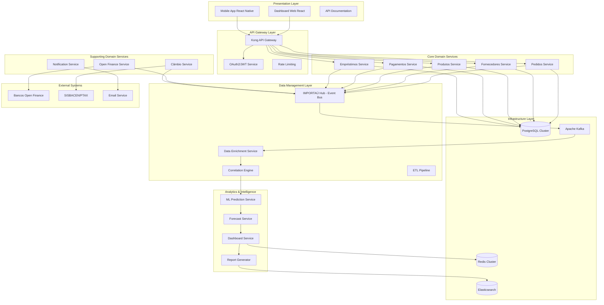
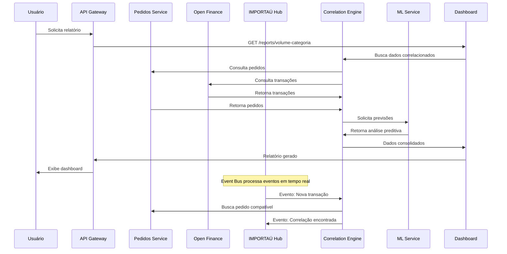
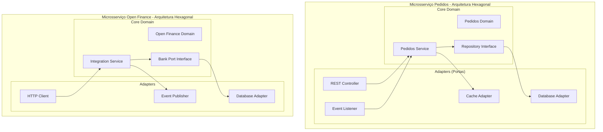
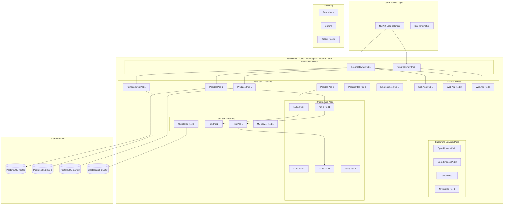
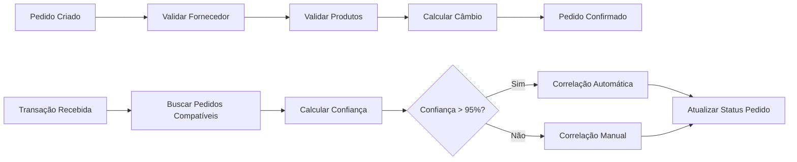
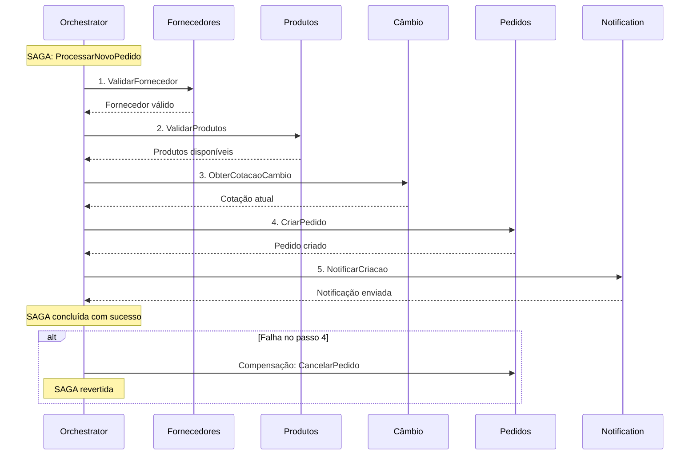
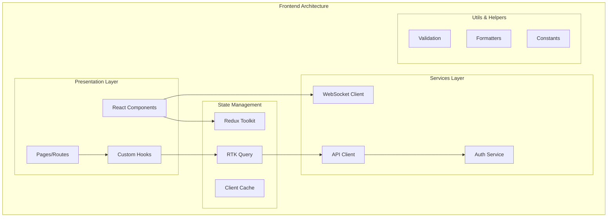
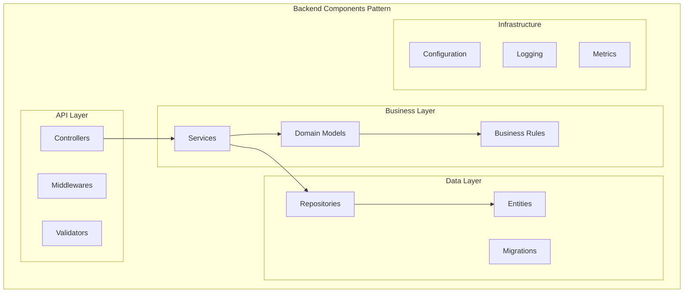

# Documentação de Arquitetura - Sistema IMPORTAÚ Open Finance

## Visão Geral dos Componentes

### Arquitetura Geral
Sistema distribuído baseado em microsserviços com padrão Event-Driven Architecture, implementando Domain-Driven Design e arquitetura hexagonal para alta coesão e baixo acoplamento.



### Fluxo de Dados Principal



## Domain Storytelling

### História Principal: Análise de Volume de Importação

**Protagonista**: Gerente de Marketing da IMPORTAÚ  
**Objetivo**: Analisar volume de importação por categoria para decisão estratégica

**Narrativa**:
1. O Gerente de Marketing acessa o dashboard web pela manhã
2. Seleciona o período dos últimos 6 meses para análise
3. Escolhe filtrar por categoria "Eletrônicos" e país "China"
4. O sistema consulta o Correlation Engine que já processou:
   - Pedidos do Microsserviço de Pedidos
   - Transações bancárias via Open Finance
   - Dados de câmbio do SISBACEN
5. O Dashboard Service gera visualização com:
   - Volume total importado: R$ 2.5M
   - Origem dos recursos: 60% Conta Corrente, 30% Empréstimo, 10% Cartão
   - Principais fornecedores chineses
6. O ML Service fornece previsão: crescimento de 15% nos próximos 3 meses
7. O gerente exporta relatório em PDF e compartilha com diretoria
8. Sistema registra auditoria completa da consulta

### História Secundária: Correlação Automática de Transações

**Protagonista**: Sistema de Correlação (automático)  
**Objetivo**: Vincular transação bancária recebida com pedido interno

**Narrativa**:
1. Open Finance Service recebe nova transação do Itaú: R$ 50.000,00
2. Publica evento "TransacaoRecebida" no IMPORTAÚ Hub (Kafka)
3. Correlation Engine consome evento e inicia busca:
   - Consulta pedidos pendentes com valor similar (±5%)
   - Verifica data de vencimento (±3 dias)
   - Analisa descrição da transação
4. Encontra pedido PED-12345 compatível (95% confiança)
5. Atualiza status do pedido para "Pago"
6. Publica evento "CorrelacaoRealizada"
7. Notification Service envia email para analista financeiro
8. Dashboard atualiza métricas em tempo real

## Cenários de Teste BDD (Gherkin)

### Requisitos Funcionais

#### FUNC-01: Volume de Importação por Categoria
```gherkin
Funcionalidade: Visualizar volume de importação por categoria
  Como gerente de marketing
  Quero visualizar volumes agrupados por categoria
  Para identificar tendências de importação

Cenário: Consulta volume por categoria com sucesso
  Dado que existem pedidos da categoria "Eletrônicos" no valor total de R$ 100.000,00
  E existem transações bancárias correlacionadas no mesmo período
  Quando acesso o dashboard e seleciono categoria "Eletrônicos"
  E escolho o período "últimos 3 meses"
  Então devo ver o volume total de R$ 100.000,00
  E devo ver a origem dos recursos detalhada
  E devo ver os principais fornecedores da categoria

Cenário: Exportação de relatório
  Dado que visualizo dados de volume por categoria
  Quando clico em "Exportar para Excel"
  Então um arquivo Excel deve ser gerado
  E deve conter todos os dados filtrados
  E deve ser baixado automaticamente
```

#### FUNC-02: Análise Preditiva de Tendências
```gherkin
Funcionalidade: Análise preditiva de tendências
  Como gerente financeiro
  Quero ver previsões de crescimento/retração
  Para planejar estratégias futuras

Cenário: Geração de previsão com dados suficientes
  Dado que existem dados históricos de 12 meses para categoria "Têxtil"
  Quando solicito análise preditiva para "Têxtil"
  Então devo ver previsão para próximos 6 meses
  E a precisão deve ser maior que 85%
  E devo ver indicadores de sazonalidade

Cenário: Alerta de mudança significativa
  Dado que o modelo ML detecta queda de 20% em "Eletrônicos"
  Quando a análise é processada
  Então um alerta deve ser enviado para gerente financeiro
  E deve aparecer notificação no dashboard
```

#### FUNC-03: Relatórios com Filtros Personalizados
```gherkin
Funcionalidade: Relatórios com filtros personalizados
  Como usuário do sistema
  Quero aplicar múltiplos filtros
  Para análises específicas

Cenário: Aplicação de múltiplos filtros
  Dado que acesso a tela de relatórios
  Quando seleciono categoria "Eletrônicos"
  E seleciono país "China"
  E seleciono período "Janeiro a Março 2024"
  E seleciono origem "Empréstimo PJ"
  Então devo ver apenas dados que atendem todos os critérios
  E o tempo de resposta deve ser menor que 30 segundos

Cenário: Salvamento de filtros favoritos
  Dado que configurei filtros personalizados
  Quando clico em "Salvar como favorito"
  E nomeio como "Eletrônicos China Q1"
  Então os filtros devem ser salvos
  E devem aparecer na lista de favoritos
```

#### FUNC-04: Correlação Dados Operacionais e Financeiros
```gherkin
Funcionalidade: Correlação automática de dados
  Como sistema
  Quero correlacionar transações com pedidos
  Para automatizar reconciliação

Cenário: Correlação automática bem-sucedida
  Dado que existe pedido "PED-001" no valor R$ 25.000,00 com vencimento hoje
  Quando recebo transação bancária de R$ 25.000,00
  E a descrição contém referência ao fornecedor do pedido
  Então a correlação deve ser feita automaticamente
  E o pedido deve ser marcado como "Pago"
  E a confiança deve ser >= 95%

Cenário: Correlação manual para casos duvidosos
  Dado que existe transação sem correlação automática
  E a confiança é menor que 80%
  Quando analista acessa tela de correlação manual
  Então deve ver lista de transações pendentes
  E deve poder vincular manualmente
  E deve registrar justificativa
```

#### FUNC-05: Integração Open Finance
```gherkin
Funcionalidade: Integração Open Finance
  Como sistema
  Quero coletar dados bancários automaticamente
  Para manter informações atualizadas

Cenário: Coleta automática de transações
  Dado que o consentimento Open Finance está ativo
  Quando chega o horário da coleta (a cada 4 horas)
  Então o sistema deve autenticar nos bancos
  E deve coletar novas transações
  E deve processar e armazenar os dados
  E deve publicar eventos para correlação

Cenário: Tratamento de erro de conectividade
  Dado que a API do banco está indisponível
  Quando o sistema tenta coletar dados
  Então deve registrar o erro no log
  E deve tentar novamente após 30 minutos
  E deve notificar administrador após 3 tentativas
```

### Requisitos Não Funcionais

#### NAO-FUNC-01: Performance
```gherkin
Funcionalidade: Performance do sistema
  Como usuário
  Quero respostas rápidas
  Para trabalhar com eficiência

Cenário: Tempo de resposta de consultas
  Dado que faço uma consulta no dashboard
  Quando o sistema processa a requisição
  Então a resposta deve chegar em menos de 3 segundos
  E deve suportar 100 usuários simultâneos

Cenário: Processamento de alto volume
  Dado que chegam 10.000 transações em 1 hora
  Quando o sistema processa os dados
  Então todas devem ser processadas sem perda
  E a latência não deve exceder 5 segundos por transação
```

#### NAO-FUNC-02: Segurança
```gherkin
Funcionalidade: Segurança de dados
  Como administrador
  Quero garantir proteção dos dados
  Para cumprir regulamentações

Cenário: Criptografia de dados sensíveis
  Dado que dados financeiros são armazenados
  Quando verifico o banco de dados
  Então todos os dados sensíveis devem estar criptografados AES-256
  E as comunicações devem usar TLS 1.3

Cenário: Autenticação multifator
  Dado que usuário tenta fazer login
  Quando insere credenciais corretas
  Então deve ser solicitado segundo fator (SMS/App)
  E acesso só deve ser liberado após confirmação
```

#### NAO-FUNC-03: Disponibilidade
```gherkin
Funcionalidade: Alta disponibilidade
  Como usuário de negócio
  Quero sistema sempre disponível
  Para não interromper operações

Cenário: SLA de disponibilidade
  Dado que monitoro o sistema por 1 mês
  Quando calculo o uptime
  Então deve ser >= 99.5%
  E downtime não planejado deve ser < 3.6 horas/mês

Cenário: Recuperação de desastre
  Dado que ocorre falha no datacenter principal
  Quando sistema de backup é ativado
  Então recuperação deve ocorrer em < 4 horas (RTO)
  E perda de dados deve ser < 1 hora (RPO)
```

#### NAO-FUNC-04: Usabilidade
```gherkin
Funcionalidade: Usabilidade da interface
  Como usuário final
  Quero interface intuitiva
  Para usar sem treinamento extenso

Cenário: Responsividade mobile
  Dado que acesso sistema via smartphone
  Quando navego pelas telas
  Então todas devem se adaptar ao tamanho da tela
  E funcionalidades principais devem estar acessíveis

Cenário: Acessibilidade
  Dado que usuário com deficiência visual usa leitor de tela
  Quando navega pelo sistema
  Então todas as funcionalidades devem ser acessíveis
  E deve atender padrão WCAG 2.1 AA
```

#### NAO-FUNC-05: Integração
```gherkin
Funcionalidade: Capacidade de integração
  Como desenvolvedor
  Quero APIs bem documentadas
  Para integrar com outros sistemas

Cenário: Documentação OpenAPI
  Dado que acesso documentação da API
  Quando consulto endpoints disponíveis
  Então deve haver especificação OpenAPI 3.0 completa
  E deve incluir exemplos de request/response

Cenário: Rate limiting
  Dado que faço chamadas para API
  Quando excedo limite de 1000 req/min
  Então deve retornar erro 429 (Too Many Requests)
  E deve incluir header com tempo para retry
```

#### NAO-FUNC-06: Manutenibilidade
```gherkin
Funcionalidade: Facilidade de manutenção
  Como desenvolvedor
  Quero código bem testado
  Para fazer mudanças com segurança

Cenário: Cobertura de testes
  Dado que executo suite de testes
  Quando analiso relatório de cobertura
  Então deve ser > 80% para todos os microsserviços
  E testes críticos devem ter 100% de cobertura

Cenário: Observabilidade
  Dado que sistema está em produção
  Quando consulto métricas
  Então deve haver dashboards Grafana configurados
  E logs devem estar estruturados em JSON
  E traces distribuídos devem estar disponíveis
```

## Topologia com Arquitetura Hexagonal

### Visão Geral da Arquitetura Hexagonal por Microsserviço



### Topologia de Implantação com Containers



## Principais Microsserviços e Endpoints

### 1. Microsserviço de Pedidos
**Base URL**: `/api/v1/pedidos`

```yaml
endpoints:
  - path: /pedidos
    methods:
      GET: Lista pedidos com filtros
      POST: Cria novo pedido
  - path: /pedidos/{id}
    methods:
      GET: Busca pedido específico
      PUT: Atualiza pedido
      DELETE: Remove pedido
  - path: /pedidos/{id}/status
    methods:
      PATCH: Atualiza status do pedido
  - path: /pedidos/categoria/{categoria}
    methods:
      GET: Lista pedidos por categoria
```

### 2. Microsserviço Open Finance
**Base URL**: `/api/v1/openfinance`

```yaml
endpoints:
  - path: /banks
    methods:
      GET: Lista bancos conectados
      POST: Adiciona novo banco
  - path: /banks/{bankId}/transactions
    methods:
      GET: Busca transações do banco
  - path: /banks/{bankId}/accounts
    methods:
      GET: Lista contas do banco
  - path: /consent
    methods:
      POST: Solicita consentimento
      DELETE: Revoga consentimento
  - path: /sync
    methods:
      POST: Força sincronização manual
```

### 3. Microsserviço de Correlação
**Base URL**: `/api/v1/correlation`

```yaml
endpoints:
  - path: /correlations
    methods:
      GET: Lista correlações realizadas
      POST: Cria correlação manual
  - path: /correlations/pending
    methods:
      GET: Lista transações pendentes
  - path: /correlations/{id}/approve
    methods:
      POST: Aprova correlação sugerida
  - path: /correlations/auto-match
    methods:
      POST: Executa correlação automática
```

### 4. Microsserviço de Dashboards
**Base URL**: `/api/v1/dashboards`

```yaml
endpoints:
  - path: /reports/volume-categoria
    methods:
      GET: Relatório volume por categoria
  - path: /reports/tendencias
    methods:
      GET: Análise de tendências
  - path: /reports/custom
    methods:
      POST: Gera relatório personalizado
  - path: /filters/favorites
    methods:
      GET: Lista filtros salvos
      POST: Salva novo filtro
```

## Modelos de Dados Simplificados

### 1. Microsserviço de Pedidos
```json
{
  "pedidos": {
    "id": "UUID PRIMARY KEY",
    "numero": "VARCHAR(50) UNIQUE",
    "fornecedor_id": "UUID FOREIGN KEY",
    "data_pedido": "TIMESTAMP",
    "data_vencimento": "TIMESTAMP",
    "valor_total": "DECIMAL(15,2)",
    "moeda": "VARCHAR(3)",
    "status": "ENUM(pendente, pago, cancelado)",
    "categoria_produto": "VARCHAR(100)",
    "pais_origem": "VARCHAR(100)",
    "created_at": "TIMESTAMP",
    "updated_at": "TIMESTAMP"
  },
  "itens_pedido": {
    "id": "UUID PRIMARY KEY",
    "pedido_id": "UUID FOREIGN KEY",
    "produto_id": "UUID FOREIGN KEY",
    "quantidade": "INTEGER",
    "valor_unitario": "DECIMAL(10,2)",
    "valor_total": "DECIMAL(15,2)"
  }
}
```

### 2. Microsserviço de Fornecedores
```json
{
  "fornecedores": {
    "id": "UUID PRIMARY KEY",
    "nome": "VARCHAR(200)",
    "documento": "VARCHAR(50)",
    "pais": "VARCHAR(100)",
    "endereco": "TEXT",
    "email": "VARCHAR(100)",
    "telefone": "VARCHAR(50)",
    "banco_preferencial": "VARCHAR(100)",
    "ativo": "BOOLEAN",
    "created_at": "TIMESTAMP"
  }
}
```

### 3. Microsserviço de Produtos
```json
{
  "produtos": {
    "id": "UUID PRIMARY KEY",
    "codigo": "VARCHAR(50) UNIQUE",
    "nome": "VARCHAR(200)",
    "categoria": "VARCHAR(100)",
    "subcategoria": "VARCHAR(100)",
    "unidade_medida": "VARCHAR(20)",
    "peso": "DECIMAL(10,3)",
    "ncm": "VARCHAR(20)",
    "ativo": "BOOLEAN"
  }
}
```

### 4. Microsserviço de Pagamentos
```json
{
  "transacoes": {
    "id": "UUID PRIMARY KEY",
    "banco_id": "VARCHAR(50)",
    "conta_id": "VARCHAR(50)",
    "valor": "DECIMAL(15,2)",
    "moeda": "VARCHAR(3)",
    "data_transacao": "TIMESTAMP",
    "descricao": "TEXT",
    "tipo_conta": "ENUM(corrente, poupanca, emprestimo, cartao)",
    "categoria_transacao": "VARCHAR(100)",
    "correlacionado": "BOOLEAN DEFAULT FALSE",
    "pedido_id": "UUID FOREIGN KEY NULLABLE"
  }
}
```

### 5. Microsserviço de Correlação
```json
{
  "correlacoes": {
    "id": "UUID PRIMARY KEY",
    "transacao_id": "UUID FOREIGN KEY",
    "pedido_id": "UUID FOREIGN KEY",
    "confianca": "DECIMAL(5,2)",
    "tipo": "ENUM(automatica, manual)",
    "status": "ENUM(pendente, aprovada, rejeitada)",
    "justificativa": "TEXT",
    "created_by": "UUID",
    "created_at": "TIMESTAMP"
  }
}
```

### 6. Microsserviço de Câmbio
```json
{
  "cotacoes": {
    "id": "UUID PRIMARY KEY",
    "moeda_origem": "VARCHAR(3)",
    "moeda_destino": "VARCHAR(3)",
    "taxa": "DECIMAL(10,6)",
    "data_cotacao": "TIMESTAMP",
    "fonte": "VARCHAR(50)",
    "tipo": "ENUM(comercial, turismo, ptax)"
  }
}
```

## Identificação de Foreign Keys Entre Microsserviços

### Relacionamentos Cross-Service
```yaml
relacionamentos:
  pedidos.fornecedor_id -> fornecedores.id:
    tipo: "Referência externa via API"
    estrategia: "Eventual consistency"
    
  itens_pedido.produto_id -> produtos.id:
    tipo: "Referência externa via API"
    estrategia: "Cache local com TTL"
    
  transacoes.pedido_id -> pedidos.id:
    tipo: "Referência externa via eventos"
    estrategia: "Event sourcing"
    
  correlacoes.transacao_id -> transacoes.id:
    tipo: "Referência direta"
    estrategia: "Strong consistency"
    
  correlacoes.pedido_id -> pedidos.id:
    tipo: "Referência externa via API"
    estrategia: "Eventual consistency"
```

### Estratégias de Consistência


## Padrão SAGA para Transações Distribuídas

### SAGA 1: Processamento de Novo Pedido
```yaml
saga_name: "ProcessarNovoPedido"
steps:
  1. ValidarFornecedor:
      service: "fornecedores"
      action: "validar_ativo"
      compensacao: "nenhuma"
      
  2. ValidarProdutos:
      service: "produtos"
      action: "validar_disponibilidade"
      compensacao: "nenhuma"
      
  3. ObterCotacaoCambio:
      service: "cambio"
      action: "obter_cotacao_atual"
      compensacao: "nenhuma"
      
  4. CriarPedido:
      service: "pedidos"
      action: "criar_pedido"
      compensacao: "cancelar_pedido"
      
  5. NotificarCriacao:
      service: "notification"
      action: "enviar_notificacao"
      compensacao: "nenhuma"

eventos:
  sucesso: "PedidoCriadoComSucesso"
  falha: "FalhaNaCriacaoPedido"
```

### SAGA 2: Correlação de Transação com Pedido
```yaml
saga_name: "CorrelacionarTransacao"
steps:
  1. ValidarTransacao:
      service: "pagamentos"
      action: "validar_transacao"
      compensacao: "marcar_transacao_invalida"
      
  2. BuscarPedidosCompativeis:
      service: "pedidos"
      action: "buscar_por_criterios"
      compensacao: "nenhuma"
      
  3. CalcularConfianca:
      service: "correlacao"
      action: "calcular_score"
      compensacao: "nenhuma"
      
  4. AtualizarStatusPedido:
      service: "pedidos"
      action: "marcar_como_pago"
      compensacao: "reverter_status_pedido"
      
  5. RegistrarCorrelacao:
      service: "correlacao"
      action: "criar_registro"
      compensacao: "remover_correlacao"
      
  6. NotificarCorrelacao:
      service: "notification"
      action: "notificar_usuarios"
      compensacao: "nenhuma"

eventos:
  sucesso: "CorrelacaoRealizadaComSucesso"
  falha: "FalhaCorrelacao"
```

### Implementação do Padrão SAGA


## Justificativas Técnicas

### 1. Escolha da Arquitetura de Microsserviços
**Decisão**: Implementar arquitetura de microsserviços com DDD
**Justificativa**:
- **Escalabilidade independente**: Cada domínio pode escalar conforme demanda específica
- **Tecnologias heterogêneas**: Open Finance (Node.js) vs ML (Python) vs Core (Java)
- **Equipes autônomas**: Desenvolvimento paralelo por domínios de negócio
- **Resiliência**: Falha em um serviço não compromete todo o sistema
**Custo vs Benefício**: Alto custo inicial de infraestrutura compensado pela flexibilidade e manutenibilidade

### 2. Padrão Event-Driven Architecture
**Decisão**: Usar Apache Kafka como message broker central
**Justificativa**:
- **Desacoplamento temporal**: Serviços não precisam estar online simultaneamente
- **Auditoria completa**: Todos os eventos ficam persistidos
- **Reprocessamento**: Possibilidade de replay de eventos para correções
- **Escalabilidade**: Suporte a milhões de eventos por segundo
**Custo vs Benefício**: Complexidade adicional justificada pela necessidade de correlação em tempo real

### 3. Arquitetura Hexagonal por Microsserviço
**Decisão**: Implementar ports & adapters em cada serviço
**Justificativa**:
- **Testabilidade**: Core domain isolado de dependências externas
- **Flexibilidade**: Troca de adapters sem impacto no negócio
- **Manutenibilidade**: Separação clara entre lógica de negócio e infraestrutura
**Custo vs Benefício**: Overhead de desenvolvimento compensado pela qualidade do código

### 4. CQRS (Command Query Responsibility Segregation)
**Decisão**: Separar operações de escrita e leitura
**Justificativa**:
- **Performance**: Otimização específica para consultas analíticas
- **Escalabilidade**: Read replicas independentes para relatórios
- **Complexidade de queries**: Agregações complexas sem impacto em transações
**Custo vs Benefício**: Duplicação de dados justificada pela performance de relatórios

### 5. Padrão SAGA para Transações Distribuídas
**Decisão**: Implementar SAGA Orchestration para fluxos críticos
**Justificativa**:
- **Consistência eventual**: Garantia de integridade sem locks distribuídos
- **Compensação**: Capacidade de reverter operações em caso de falha
- **Observabilidade**: Rastreamento completo de transações distribuídas
**Custo vs Benefício**: Complexidade adicional necessária para garantir consistência

### 6. Tecnologias Open Source Selecionadas
**Decisões e Justificativas**:

| Tecnologia | Justificativa | Alternativa Proprietária | Economia Anual |
|------------|---------------|-------------------------|----------------|
| PostgreSQL | Robustez, ACID, JSON support | Oracle Database | R$ 500.000 |
| Apache Kafka | Throughput, durabilidade | AWS Kinesis | R$ 200.000 |
| Redis | Performance, clustering | AWS ElastiCache | R$ 100.000 |
| Elasticsearch | Full-text search, analytics | Splunk | R$ 300.000 |
| Kubernetes | Orquestração, portabilidade | AWS EKS | R$ 150.000 |
| Prometheus/Grafana | Observabilidade completa | DataDog | R$ 180.000 |

**Total de Economia Estimada**: R$ 1.430.000/ano

## Referências das Decisões

### 1. Padrões Arquiteturais Aplicados
- **Domain-Driven Design (DDD)**: Eric Evans - "Domain-Driven Design: Tackling Complexity"
- **Microservices Pattern**: Chris Richardson - "Microservices Patterns"
- **Event Sourcing**: Martin Fowler - "Event Sourcing Pattern"
- **CQRS**: Greg Young - "CQRS Documents"
- **Hexagonal Architecture**: Alistair Cockburn - "Hexagonal Architecture"

### 2. Tecnologias e Ferramentas
- **Apache Kafka**: Confluent Documentation - Event Streaming Platform
- **PostgreSQL**: Official Documentation - Advanced Features
- **Kubernetes**: CNCF - Container Orchestration Best Practices
- **Open Finance Brasil**: Banco Central - Regulamentação e APIs

### 3. Segurança e Compliance
- **LGPD**: Lei Geral de Proteção de Dados - Artigos 7º e 9º
- **Open Finance**: Resolução BCB nº 32/2020
- **OAuth 2.0**: RFC 6749 - Authorization Framework
- **TLS 1.3**: RFC 8446 - Transport Layer Security

### 4. Observabilidade e Monitoramento
- **The Three Pillars of Observability**: Honeycomb.io
- **SRE Practices**: Google - "Site Reliability Engineering"
- **Distributed Tracing**: OpenTelemetry Specification
- **Prometheus Monitoring**: CNCF Best Practices

### 5. Performance e Escalabilidade
- **CAP Theorem**: Eric Brewer - Consistency, Availability, Partition tolerance
- **Reactive Manifesto**: Principles of Reactive Systems
- **12-Factor App**: Heroku - Methodology for SaaS applications

## Componentes de Frontend

### Arquitetura Frontend


### Componentes Backend por Microsserviço



---

**Documento elaborado por**: Arquiteto de Software Experiente  
**Data**: 2025-12-10  
**Versão**: 1.0  
**Status**: Aprovado para desenvolvimento  
**Próxima revisão**: Após implementação da Fase 1
